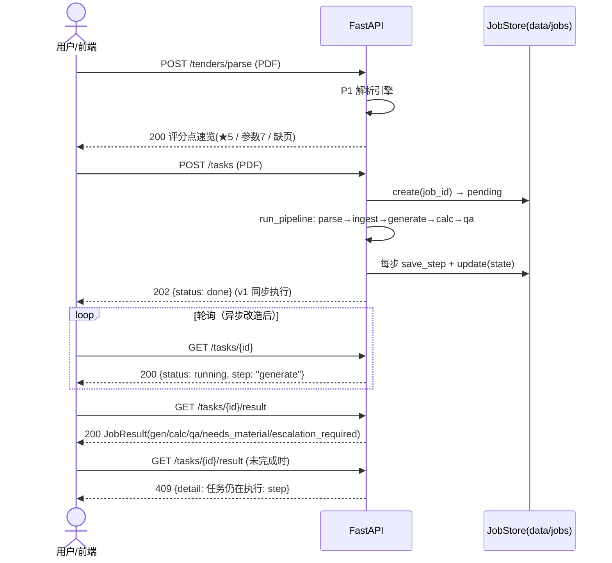
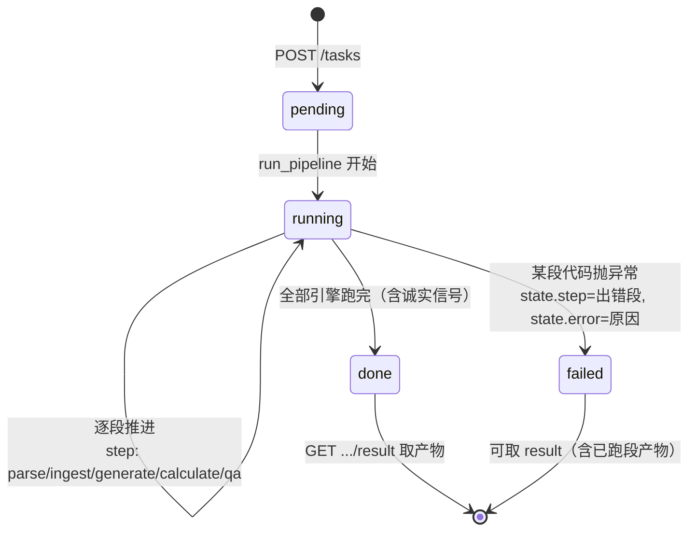

# 应标 Agent — API 层设计（Phase 6）

> 本篇回答四个"为什么"，然后给接口契约。业务痛点/面试点总览见父目录 `README.md`。

## 0. 四个核心设计决定

### ① 为什么用"任务（Job）"而不是同步请求直接算完

一条标从上传 PDF 到 QA 报告，走的是 **parse→ingest→generate→calculate→qa** 五步流水线：
动辄数秒~分钟级（解析整本 PDF、建向量库、逐评分点检索生成、逐条数值核对、LLM-as-Judge），
且中间有**有状态**步骤（内存向量库要先 ingest 语料才能检索）。

把它塞进一个同步 HTTP 请求意味着：
- 调用方（前端 / 用户在浏览器）要干等几十秒，代理/网关极易超时；
- 一旦某步失败，只知道"500"，不知道**卡在哪一步**、为什么失败；
- 结果只存在于内存，进程重启就丢，无法事后审计/复现。

所以 API 层把"一条标"抽象成一个 **job**：有独立 id、有状态机、产物逐段落盘
（`data/jobs/{job_id}/`），调用方 `POST` 建任务 → **轮询** `GET /tasks/{job_id}` →
`done` 后拉 `GET /tasks/{job_id}/result`。状态是"文件即状态"（state.json），零外部依赖也能跑。

### ② 一条标 = 流水线 job，但每个引擎仍然可以单独调

Job 是"整条标"的编排壳，**不是**对引擎的替代：

| 入口 | 用途 |
|---|---|
| `POST /tenders/parse` | 只跑 P1 解析引擎 → 返回评分点/★/参数表速览。人工先看"这份标书认不认识"，再决定要不要全文跑。|
| `POST /tasks` | 完整五步流水线（一次跑完一条标）。|
| `core/…` 各引擎 | 库级调用。测试、Phase 7 报告器、Phase 8 eval-harness 都直接 import 引擎，不走 HTTP。|

引擎保持 **无 FastAPI 依赖**：编排只在 `app/jobs.py:run_pipeline`，要加"仅生成"/"仅核对"
等半程模式，只需在编排层加一个入口，不动任何引擎。

### ③ 每步产物 JSON 落盘 = 审计 + 可复现 + 给 Phase 7/8 的后门

`data/jobs/{job_id}/` 工作区：

```
input.pdf                 调用方上传的原始招标书
state.json                pending/running/done/failed + 当前 step + 错误
result.json               JobResult：gen/calc/qa 三份引擎总结 + 待补材料 + 拦截标记
steps/
  01_parse_doc.json       TenderDoc（结构化全文）
  01_parse_report.json    解析报告（缺页/未解析段）
  03_gen_summary.json     逐评分点应答摘要
  03_gen_answers.json     每点完整应答+引用
  04_calc_summary.json    数值核对结果
  05_qa_report.json       QA 风险清单
```

- **审计**：每一步跑出什么，都有不可抵赖的快照，出了问题能追到"哪一步的哪个输入产出错"。
- **可复现**：`input.pdf + 语料版本 + 引擎版本` 固定，重跑应得同一份 result —— 这正是
  Phase 8 eval-harness 要回放的对象。
- **后门**：Phase 7 报告器/UI 可以直接读 `steps/*.json` 渲染，不必重跑引擎。

### ④ 错误分段哲学：API 不吞引擎的诚实信号

两类"错误"必须分开：
- **引擎诚实信号**：gap（无上下文）、UNKNOWN（无法判定）、BLOCK（废标级硬伤）、needs_material
  （缺材料）——这是**结果的一部分**，必须原样留在产物里，绝不能被 API 层吞成"失败"。
  样例里 calc 的 2 条"正偏离优于要求"、qa 的 2 条 WARN 都不是失败，是给业务看的信号。
- **真异常**：代码真的抛错（文件解析不了、某引擎 bug）。此时 job 置 `failed`，并**精确到段**
  标注是第几步、什么异常（`state.step` + `state.error`），而不是让整条请求 500。

对应到 HTTP：**输入错 → 4xx**（非 PDF→400、超大→413、任务不存在→404、还没跑完→409）；
**引擎内部不该发生的错**才是 5xx。测试锁定这一条：坏文件必须是 400，不是 500。

## 1. 接口表

| 方法 | 路径 | 作用 | 返回 | 关键错误 |
|---|---|---|---|---|
| GET | `/health` | 存活探针 | `{"status":"ok"}` | — |
| GET | `/` | 运行态（provider/docs/endpoints 一览） | dict | — |
| POST | `/tenders/parse` | 解析招标书 → 评分点/★/参数表速览 | `ParseOutcome` | 400 非 PDF / 413 超 50MB |
| POST | `/tasks` | 上传招标书 → 建 job → 同步跑完整流水线 | `JobState`(202) | 400 非 PDF |
| GET | `/tasks/{id}` | 轮询状态（含当前 step） | `JobState` | 404 不存在 |
| GET | `/tasks/{id}/result` | 拉整条产物（gen/calc/qa+待补+拦截） | `JobResult` | 404 / 409 未完成 |
| GET | `/reports` | HTML 目录页（全部任务，可点开/下载） | text/html | — |
| GET | `/reports/{id}` | HTML 报告页（一屏结论/风险置顶/逐点/核对） | text/html | 404 无任务/无产物 |
| GET | `/reports/{id}/export?fmt=md\|xlsx` | 下载报告（Markdown / Excel 四 sheet） | 文件 | 404 / 400 fmt 非法 |

> Phase 7 报告器详见 [`docs/report.md`](report.md)：纯派生不重跑引擎、单一产物源三出口、HTML 由 FastAPI 同进程出。

## 2. HTTP 时序



## 3. 任务状态机



状态字段（`JobState`）：`job_id / status / step / error / created_at`。
`status ∈ pending|running|done|failed`；`step` 失败时精确到段（如 `generate`），成功为 `done`。

## 4. JobResult：一条标收口的产物

- `score_points`：评分点速览（带 ★/分/证据类型）；
- `gen: GenerationSummary`：应答覆盖（total/answered/star_answered）；
- `calc: CalcSummary`：数值核对（total/conform/over/under/unknown + ★负偏离 + 待人工）；
- `qa: QaReport`：风险清单（block/warn/info + escalation_required + needs_material）；
- 派生字段（`computed_field`，进序列化）：
  - `needs_material`：全链路并集的待补材料（盖章原件/报价表…）；
  - `escalation_required`：是否出现 BLOCK（废标级，Phase 7 报告据此置顶拦截）。

## 5. 样例实测（离线 mock，同一份 fixtures 语料）

对 `fixtures/tender_sample.pdf` 实测：

```
POST /tenders/parse → 200  ok  评分点 6（★5） 参数表 7  0 缺页
POST /tasks          → 202  done
GET  .../result      → 200
   gen  total/answered = 6 / 5      （★4/5 已答，1 点缺材料未答）
   calc total/conform/over/under = 14 / 12 / 2 / 0   （2 条正偏离优于要求，无负偏离）
   qa   block/warn/info = 0 / 2 / 0 → escalation_required = False
   needs_material = [售后服务承诺函（盖章原件）, 报价一览表（须按招标格式填报）]
错误路径：非 PDF → 400；未知任务 → 404（GET 状态与 result 皆 404）
```

> 数字随语料/样例漂移，测试断言只锁形状不锁数值。简历 STAR 数字一律来自 Phase 8 eval-harness 实测。

## 6. 已知局限（Phase 6）

- **单进程 dict/file 状态**：`JobStore` 状态在文件系统，但 job 运行期内存表在进程内；
  多 worker/多机横向扩展需换外部存储 + 任务队列（当前单用户 demo 足够）。
- **同步执行**：`POST /tasks` 同步跑完才返回；改 BackgroundTasks/Celery 只需动
  `app/routers/tasks.py:create_task`，引擎与落盘结构零改动。
- **语料固定**：默认 `fixtures/corpus`（三份 markdown），尚无上传自定义语料的接口（Phase 7 后置）。
- **无鉴权/限流**：本地/内网工具定位。

## 7. 跑起来

```bash
uv run uvicorn app.main:app --reload          # 起服务（默认 mock，无 key）
# 浏览器 http://127.0.0.1:8000/docs 看交互式文档

# ① 只看评分点速览
curl -s -F "file=@fixtures/tender_sample.pdf" http://127.0.0.1:8000/tenders/parse

# ② 跑完整条标（同步，202 返回即终态）
curl -s -F "file=@fixtures/tender_sample.pdf" http://127.0.0.1:8000/tasks
#   → {"job_id":"…","status":"done","step":"done",…}

# ③ 轮询 / 拉产物
curl -s http://127.0.0.1:8000/tasks/{JOB_ID}
curl -s http://127.0.0.1:8000/tasks/{JOB_ID}/result

# ④ 报告（Phase 7）：目录页 / HTML 报告 / 下载 md / xlsx
curl -s http://127.0.0.1:8000/reports/{JOB_ID}
curl -s -o report.md  http://127.0.0.1:8000/reports/{JOB_ID}/export?fmt=md
curl -s -o report.xlsx http://127.0.0.1:8000/reports/{JOB_ID}/export?fmt=xlsx
```
