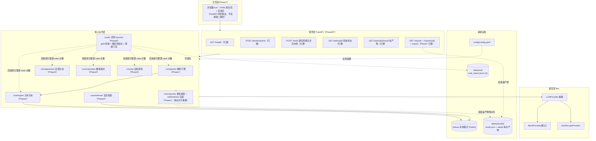
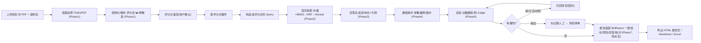

# 应标 Agent — 架构文档

> 本文件随代码演进持续更新（AI 编码每阶段都需保持 mermaid 与代码一致）。
> 仓库总览 / 快速开始 / 实测见根目录 [`README.md`](../README.md)；内部设计说明书（需求/痛点/面试要点）见
> `D:\develop\MyProject\README.md`（不随本仓库分发）。

## Phase 8（当前）：评测与验收（eval-harness）

- 评测层：`evals/`（dataset/adversarial/metrics/harness/run）——带 gold 的评测集回放 + 确定性指标 +
  阈值门禁。gold 人工策展带版本身份（AnnotationMeta），坏例 gold=注入语义、张冠李戴诚实门控待真模型；
  指标纯函数与引擎无关可回归；CLI `uv run python -m evals.run` 落 `data/eval/eval_report.{json,md}` 并做
  五道门禁。详见 [`docs/eval.md`](eval.md)。**实测摘要（mock 确定性基线）**：解析 F1 1.0、混合检索
  R@5 0.7333/MRR 0.7000（纯向量基线 0.7833/0.8000，delta 为负故不宣称混合更优）、坏例检出 3/3=1.0、
  好例误报 0、端到端约 0.13s（离线 mock 墙钟）/ 21 LLM calls。
- 服务层：FastAPI（`app/main.py`）把 P1–P5 收成接口 —— `/health`、`/` 根路由，
  `POST /tenders/parse`（评分点速览）、`POST /tasks` + `GET /tasks/{id}` +
  `GET /tasks/{id}/result`（一条标 = 一个 job，五步流水线产物逐段落盘）。详见 [`docs/api.md`](api.md)。
- 任务编排：`app/jobs.py` `run_pipeline` 按 parse→ingest→generate→calc→qa 跑，
  `JobStore` 文件即状态（data/jobs/{id}/：input.pdf + state.json + result.json + steps/），
  错误分段：输入错→4xx，引擎真异常→failed 并注明步骤，不吞诚实信号。
- 报告层：`core/reporter/`（schemas/service/render）+ `app/artifacts.py` + `app/routers/reports.py`——
  **纯派生视图**读落盘产物重排成 BidReport，不重跑引擎；HTML 报告页/目录页 + md/xlsx 导出；
  UI 取舍：FastAPI 同进程出 HTML（不自建第二服务）。详见 [`docs/report.md`](report.md)。
- 模型层：`llm/` 抽象 + Mock（默认离线可跑）+ DashScope 骨架。
- 配置层：`config/config.yaml` 已预留全量参数 + `config/settings.py` 强类型加载（embedding/rerank/generator 默认 mock）。
- 解析层：`core/parser/` 双通道（规则锚点 + LLM 抽取）已实现，PDF→`TenderDoc`+`ParseReport`。详见 [`docs/parser.md`](parser.md)。
- 检索层：`core/ingest`(切块入库) + `core/embeddings`(Provider化) + `core/vector_store`(qdrant本地) +
  `core/retriever`(Dense+BM25→RRF→Rerank) 已实现。详见 [`docs/retrieval.md`](retrieval.md)。
- 生成层：`core/generator/` 逐评分点检索→限量上下文→批量结构化应答→三层幻觉控制（prompt 约束/空上下文 gap/引用编号代码校验）已实现。
  详见 [`docs/generator.md`](generator.md)。
- 数值核对层：`core/calculator/` 招标数值要求 × 我方能力 → 逐条偏离判定（纯代码计算器，能算的绝不让模型算；
  数字陷阱防误抽 + 单位归一 + 三态一灰 + ★负偏离记账）。详见 [`docs/calculator.md`](calculator.md)。
- 自检质检层：`core/qa/` 三层防线收口 —— 代码判三路（覆盖率/数值偏离复核/数值自洽·超承诺）+
  LLM-as-Judge（旧数据/不实/答非所问，防御校验）+ 改写闭环限次 → QaReport 风险清单
  （BLOCK 即 escalation）。详见 [`docs/qa.md`](qa.md)。

### 系统分层架构



### 主流程（一条标跑完）



## 运行方式（Phase 8）

```bash
uv run pytest                # 全部测试（离线，不联网，100 passed）
uv run pytest tests/test_eval.py   # Phase 8 eval 专项（18 项）

# ---- 评测（Phase 8）----
uv run python -m evals.run         # 跑 mock 确定性基线 → data/eval/eval_report.{json,md} + 五道门禁
uv run python -m evals.run --no-gate   # 只报告不做门禁退出
#   provider=dashscope 时会被明确拒绝（DashScope LLM Provider 尚为骨架），见 docs/eval.md §8

# ---- 服务层（Phase 6/7）----
uv run uvicorn app.main:app --reload          # 起服务；浏览器 http://127.0.0.1:8000/docs
#   ① 只看评分点速览
curl -s -F "file=@fixtures/tender_sample.pdf" http://127.0.0.1:8000/tenders/parse
#   ② 跑完整条标（一条标=一个 job，v1 同步返回终态）
curl -s -F "file=@fixtures/tender_sample.pdf" http://127.0.0.1:8000/tasks
#   ③ 拉产物：gen/calc/qa + needs_material + escalation_required
curl -s http://127.0.0.1:8000/tasks/{JOB_ID}/result
#   更多契约/时序/状态机/错误分段见 docs/api.md
#   ④ 报告（Phase 7）：目录页 → HTML 报告 → 下载 md / xlsx
#      浏览器打开 http://127.0.0.1:8000/reports
curl -s http://127.0.0.1:8000/reports/{JOB_ID}                      # HTML 报告页
curl -s -o report.md  http://127.0.0.1:8000/reports/{JOB_ID}/export?fmt=md
curl -s -o report.xlsx http://127.0.0.1:8000/reports/{JOB_ID}/export?fmt=xlsx
#   报告器结构/渲染/局限见 docs/report.md

# ---- 引擎直调 demo（库级，不走 HTTP）----
uv run python scripts/make_tender_fixture.py   # 重新生成样例招标书 PDF fixture
uv run python - <<'PY'       # 一条标：解析 → 入库 → 逐点应答 → 数值核对 → 自检质检（demo）
import asyncio
from pathlib import Path
from config.settings import get_settings
from core.calculator import Calculator, extract
from core.generator import Generator
from core.ingest import ingest_corpus
from core.parser.pipeline import parse_tender
from core.qa import QaService
from core.retriever import Retriever
from core.vector_store import VectorStore
from llm.mock_provider import MockProvider
async def main():
    s = get_settings(); llm = MockProvider(s)
    doc, _ = await parse_tender("fixtures/tender_sample.pdf", llm)     # ① 解析：评分点+参数表+★
    st = VectorStore(s.vector_db.collection, s.embedding.dimension, path=":memory:")
    await ingest_corpus("fixtures/corpus", st, s)
    answers, gsum = await Generator(s, llm).generate(                   # ② 应答生成（Phase3）
        doc.score_points, Retriever(s, st).retrieve, doc.tender_title)
    print("GEN", gsum)
    offers = []                                                         # ③ 数值核对（Phase4）
    for f in ["product-guide.md", "qualifications-and-service.md", "cases.md"]:
        offers += extract.from_text((Path('fixtures/corpus') / f).read_text(encoding='utf-8'), f)
    checks, csum = Calculator(s).check(extract.from_tender_doc(doc), offers)
    print("CALC", csum.model_dump())
    # ④ 自检质检（Phase5）：三路代码判 + Judge + 改写闭环
    qrep, _ = await QaService(s, llm).run(points=doc.score_points, answers=answers, checks=checks,
        offers=offers, tender_title=doc.tender_title, buyer=doc.buyer, deadline=doc.deadline)
    print("QA", qrep.block_count, qrep.warn_count, qrep.info_count, qrep.escalation_required)
    for i in qrep.issues:
        print("  -", i.severity.value.upper(), i.kind.value, i.point_id, "|", i.reason[:70])
asyncio.run(main())
PY
```

> 换真实模型：填 `.env` 的 `DASHSCOPE_API_KEY`，把 `config/config.yaml` 的 `llm.provider` 改为 `dashscope` 即可，业务代码零改动。
