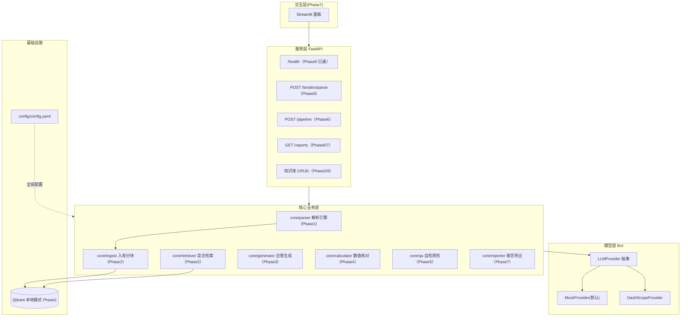
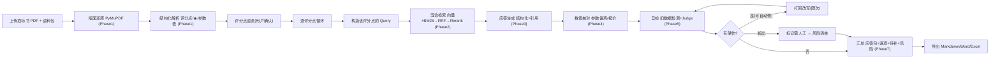

# 应标 Agent — 架构文档

> 本文件随代码演进持续更新（AI 编码每阶段都需保持 mermaid 与代码一致）。
> 设计说明书（需求/痛点/面试点）见父目录 `README.md`。

## Phase 0（当前）：项目骨架已就绪

- 服务层：FastAPI（`app/main.py`）`/health`、`/`，配置启动即校验。
- 模型层：`llm/` 抽象 + Mock（默认离线可跑）+ DashScope 骨架。
- 配置层：`config/config.yaml` 已预留全量参数 + `config/settings.py` 强类型加载。
- 核心层：`core/parser|ingest|retriever|generator|calculator|qa|reporter` 占位就绪，待逐 Phase 填充。

### 系统分层架构



### 主流程（一条标跑完）



## 运行方式（Phase 0）

```bash
uv run pytest                # 全部测试（离线，不联网）
uv run uvicorn app.main:app --reload   # 起服务
# 浏览器打开 http://127.0.0.1:8000/docs 看接口
```

> 换真实模型：填 `.env` 的 `DASHSCOPE_API_KEY`，把 `config/config.yaml` 的 `llm.provider` 改为 `dashscope` 即可，业务代码零改动。
