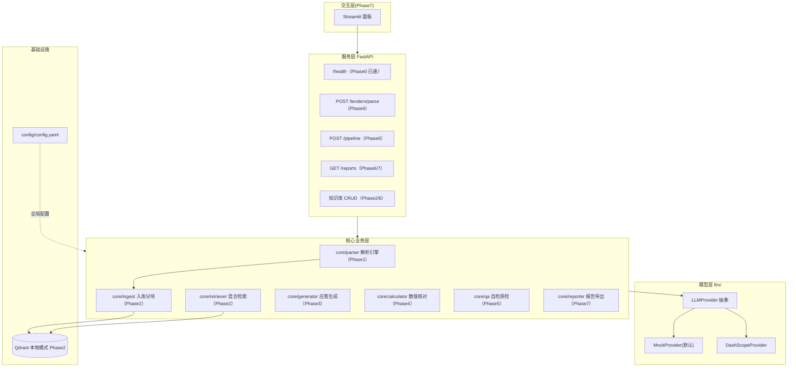
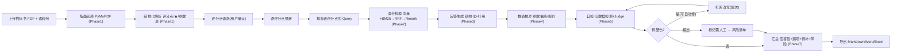

# 应标 Agent — 架构文档

> 本文件随代码演进持续更新（AI 编码每阶段都需保持 mermaid 与代码一致）。
> 设计说明书（需求/痛点/面试点）见父目录 `README.md`。

## Phase 3（当前）：应答生成已就绪

- 服务层：FastAPI（`app/main.py`）`/health`、`/`，配置启动即校验。
- 模型层：`llm/` 抽象 + Mock（默认离线可跑）+ DashScope 骨架。
- 配置层：`config/config.yaml` 已预留全量参数 + `config/settings.py` 强类型加载（embedding/rerank/generator 默认 mock）。
- 解析层：`core/parser/` 双通道（规则锚点 + LLM 抽取）已实现，PDF→`TenderDoc`+`ParseReport`。详见 [`docs/parser.md`](parser.md)。
- 检索层：`core/ingest`(切块入库) + `core/embeddings`(Provider化) + `core/vector_store`(qdrant本地) +
  `core/retriever`(Dense+BM25→RRF→Rerank) 已实现。详见 [`docs/retrieval.md`](retrieval.md)。
- 生成层：`core/generator/` 逐评分点检索→限量上下文→批量结构化应答→三层幻觉控制（prompt 约束/空上下文 gap/引用编号代码校验）已实现。
  详见 [`docs/generator.md`](generator.md)。
- 占位待填：`core/calculator|qa|reporter`（Phase 4 起逐 Phase 填充）。

### 系统分层架构



### 主流程（一条标跑完）



## 运行方式（Phase 3）

```bash
uv run pytest                # 全部测试（离线，不联网，26 passed）
uv run python scripts/make_tender_fixture.py   # 重新生成样例招标书 PDF fixture
uv run python - <<'PY'       # 一条标：解析评分点 → 入库语料 → 逐点检索 → 带引用应答（demo）
import asyncio
from config.settings import get_settings
from core.generator import Generator
from core.ingest import ingest_corpus
from core.parser.pipeline import parse_tender
from core.retriever import Retriever
from core.vector_store import VectorStore
from llm.mock_provider import MockProvider
async def main():
    s = get_settings()
    llm = MockProvider(s)
    doc, _ = await parse_tender("fixtures/tender_sample.pdf", llm)   # 评分点
    st = VectorStore(s.vector_db.collection, s.embedding.dimension, path=":memory:")
    await ingest_corpus("fixtures/corpus", st, s)                    # 语料入库
    answers, summary = await Generator(s, llm).generate(
        doc.score_points, Retriever(s, st).retrieve, doc.tender_title)
    print(summary)
    for a in answers:
        print(a.point_id, "needs_human=", a.needs_human, "cites=", [c.source for c in a.citations])
asyncio.run(main())
PY
uv run python - <<'PY'       # 看一次入库 + 检索（demo）
import asyncio
from config.settings import get_settings
from core.ingest import ingest_corpus
from core.retriever import Retriever
from core.vector_store import VectorStore
async def main():
    s = get_settings()
    st = VectorStore(s.vector_db.collection, s.embedding.dimension, path=":memory:")
    await ingest_corpus("fixtures/corpus", st, s)
    for r in await Retriever(s, st).retrieve("高清网络摄像机 400万像素", top_k=3):
        print(r.final_rank, r.source, "|", r.heading)
asyncio.run(main())
PY
import asyncio
from config.settings import get_settings
from core.ingest import ingest_corpus
from core.retriever import Retriever
from core.vector_store import VectorStore
async def main():
    s = get_settings()
    st = VectorStore(s.vector_db.collection, s.embedding.dimension, path=":memory:")
    await ingest_corpus("fixtures/corpus", st, s)
    for r in await Retriever(s, st).retrieve("高清网络摄像机 400万像素", top_k=3):
        print(r.final_rank, r.source, "|", r.heading)
asyncio.run(main())
PY
uv run uvicorn app.main:app --reload   # 起服务
# 浏览器打开 http://127.0.0.1:8000/docs 看接口
```

> 换真实模型：填 `.env` 的 `DASHSCOPE_API_KEY`，把 `config/config.yaml` 的 `llm.provider` 改为 `dashscope` 即可，业务代码零改动。
