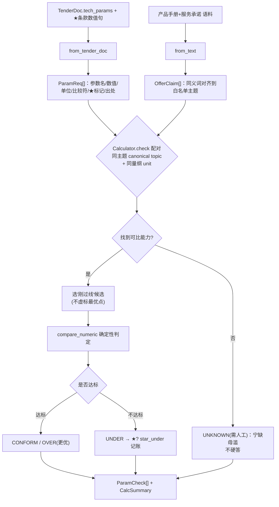

# Phase 4 交付报告 — 数值核对（Calculator）

> 由 AI 编码生成，作为本阶段的分析与验收依据。代码即文档：若改动，请同步更新本文。

## 1. 本阶段目标与验收结果

把"招标要求里的数值条款"与"我方能力/承诺值"变成**逐条可判定的偏离清单**——这是从组2-B
"code-interpreter"嫁接进来的核心卖点：**能算的绝不让模型算**，比较与判定全部走确定性代码。

| 验收项 | 结果 |
|---|---|
| `uv run pytest` | ✅ 42 passed（含 Phase 0–3 回归 26 + 新增 16） |
| 样例端到端核对 | ✅ 招标侧 14 条数值要求 → 我方语料能力 15 条（product-guide 11 + qualifications 4）→ 全配对，0 unknown |
| 判定分布 | ✅ conform=12 · over=2 · under=0 · unknown=0（样例产品刻意全达标，无负偏离、无误报） |
| 解析防误抽 | ✅ 7×24 / 1/1.8英寸 / GB/T28181 / 2560×1440 / H.265 / 付款30% 等一概不当数值 |
| 单位归一 | ✅ 年→月、日历天→天、GB/TB→MB、万像素→像素，同量纲才比 |
| ★ 负偏离记账 | ✅ `summary.star_under` 单独列（对抗用例验证捕获：900万要求 vs 800万能力 → under） |
| 全链路离线 | ✅ Mock + 纯代码核心，确定性可回归 |

**样例实测输出（真实解析的 TenderDoc × 真实语料能力）**：

```
招标侧要求 14 条：技术参数表 11（分辨率/照度/接入路数/存储周期/CPU/内存/AI分析/误报率/容量/并发/光缆芯）
                  ★ 条款 3（工期≤120天 / 质保≥3年 / 重大故障≤2小时到场）
我方能力   15 条：product-guide.md 11 + qualifications-and-service.md 4（cases.md 业绩金额被正确忽略）
核对结果  conform=12  over=2  under=0  unknown=0
  over 示例：最低照度 我方0.003Lux < 要求≤0.005Lux（更低更优）；工期 我方98天 < ≤120天（更短更优）
  ★ 全覆盖满足 → star_under = []（样例=合规投标人，引擎零误报）
```

> 为什么样例"全过"反而是对的价值：它证明引擎**不误报**。真实风险项（如把摄像机写 300 万去应
> ≥400 万 ★）由对抗用例 + 单测覆盖，见 §7。

## 2. 模块结构

```
core/calculator/
├── schemas.py    数据契约：NumericValue/ParamReq/OfferClaim/ParamCheck/CalcSummary
├── numeric.py    ★计算器核心：单位/倍率归一表 + 数字陷阱打码 + parse_numeric + compare_numeric（纯代码）
├── extract.py    抽取：from_tender_doc(招标侧) + from_text(我方语料) + 同义词对齐
├── service.py    Calculator.check：配对(同主题+同量纲) → 选刚过线候选 → 判定 + 代码侧汇总
└── __init__.py   门面 / build_calculator(settings, llm)
```

## 3. 核对主链路（mermaid）



## 4. 三态一灰判定表（投标语义）

| 判定 | 含义 | 处理 |
|---|---|---|
| **CONFORM** | 我方值满足要求（恰在边界也算，防误报） | 通过 |
| **OVER（正偏离）** | 超出要求（更低照度、更短工期） | 安全，可作加分点写进应答 |
| **UNDER（负偏离）** | 达不到要求 | ★ → `star_under`（废标级，直送 Phase5/风险清单）；非★ → 丢分/商务被动 |
| **UNKNOWN** | 无数值条款/找不到可比能力 | `needs_human=True`，绝不替模型"觉得对" |

**判定铁律**：
1. **量纲一致才比**：两边都折算到基准单位；对不上 → UNKNOWN，不硬比。
2. **等值边界判 CONFORM 而非误报**：`≥400万` 我方恰 `400万` → 满足。
3. **"刚过线"选择**：同主题有多个达标型号时选最近上界的最小值——投标人用达标型号即可
   合规，不必虚标更优；若都不达标取最强值，给出"最强声明仍负偏离"的结论。
4. **我方声明带 `≥`（如 NVR 接入能力≥32路）** 视作"最低可保证 32 路"，对要求 `≥32` 判
   满足而非 OVER。

## 5. 数字陷阱清单（parse_numeric 防误抽，面试可背几条）

| 陷阱 | 例 | 为什么不能抽 |
|---|---|---|
| 复合模式 | 7×24 小时 | 是"每周7天每天24h"，不是 7 或 24 |
| 分数 | 传感器 1/1.8 英寸 | 型号比例，非达标量 |
| 标准号 | GB/T28181、H.265、ISO9001 | 里面数字是代号 |
| 分辨率乘积 | 2560×1440 | 括号内辅助信息 |
| 产品型号 | HC-IPC 400W | 名称里的数字 |
| 编号 | ★5.2 | 条款编号 5.2 不是数值 |
| 金额里程碑 | 支付 30% | 百分比是合同金额比例，非达标阈值 |
| 单位混淆 | 内存 vs 内容 的"内" | "内"只有紧邻时间单位才是上界(2小时内) |

## 6. 已知局限（面试主动讲，加分）

1. **一维"参数名关键词"配对**：招标参数行常是"设备×多参数"复合句，本实现用同义词对齐后的
   关键词配对（如 分辨率/质保期/工期），**不是** (设备×参数) 两级键。同义词表随行业语料扩；
   对不上的 → UNKNOWN（安全方向）。
2. **非数值条款不归 Phase 4**：如"具备电子地图/报警联动"这类功能有无，数值核对判不了 →
   归 Phase 5 自检 / 人工。只抽得到"带比较词的数值"才判。
3. **量纲/复合约束有限**：`0.003Lux(彩)/0.001Lux(黑)` 只取首个；`>100路` 与"含利旧"等
   工程语义需人工；同义词表不完备 → 宁可 UNKNOWN。
4. **金额/价格偏离不在本阶段**：报价大小写、总价=分项之和等一致性核对属"钱"，与 Phase 4
   的"参数能力达标"不同源，留 Phase 7 报价模块或后续扩展（数值一致性是 code-interpreter
   的另一半卖点）。
5. 抽取走规则（确定性）；复杂/无结构段落的 LLM 兜底通道在 `Calculator(llm=…)` 预留，
   当前语料规整，未触发（接真实语料时启用，比较仍走代码）。

## 7. 测试清单

```
tests/test_calculator.py      单测 15：解析陷阱(万/月/日历天/内/噪音/编号) · 单位归一 · 比较方向(边界/over/under)
                              抽取同义词 · ★under 记账 · 无能力→UNKNOWN · 刚过线选型 · 噪音标签不入能力表
tests/test_calculation_e2e.py 端到端：PDF→TenderDoc→14要求×语料能力→核对；断言 无负偏离/无误报/★全满足/出处可溯源
```

对抗用例（证明能"抓坏"）：★ 要求 900 万像素 vs 我方仅 800 万 → `verdict=UNDER` 且计入
`star_under` —— 若产品手册里真有一个 300W 的摄像机型号被误填进应答，引擎会在这一行亮红灯，
拦住"把不达标参数写进标书=废标"。
