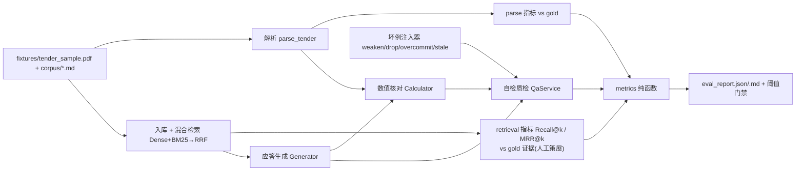

# Phase 8 交付报告 — Eval-Harness（评测）

> 由 AI 编码生成，作为本阶段的分析与验收依据。代码即文档：若改动，请同步更新本文。
> 评测集/指标/CLI 见 `evals/`（dataset / adversarial / metrics / harness / run）。

## 1. 本阶段目标与验收结果

给"应标 Agent"装上**带 gold 的评测与回归门禁**：把一份样例标回放整条流水线
（解析→入库→检索→生成→数值核对→自检质检），逐点量出 解析/检索/生成/质检 的指标，
并把"引擎被改坏、关键能力静默回退"用阈值门禁挡在 commit 之外。

| 验收项 | 结果 |
|---|---|
| `uv run pytest` | ✅ 100 passed（Phase 0–7 回归 82 + 新增 18） |
| `uv run python -m evals.run` | ✅ 落 eval_report.json/.md，五道门禁全过 |
| 评测集 gold | ✅ 解析 6 评分点 / ★5 / 参数表 7·★[1,3,5] + 检索证据人工策展 + 质检 1好例4坏例 |
| 指标纯函数 | ✅ Precision/Recall/F1、Recall@k、MRR@k、检出率/误报率 全确定性、单测手算 |
| 坏例 | ✅ ★负偏离/漏答/超承诺 代码判确定性检出 3/3；张冠李戴 诚实门控待真模型 |
| 诚实口径 | ✅ 不拿模型输出当 gold；不给自己标不存在的指标；mock 不给假账 |

**样例实测摘要（provider=mock，确定性可回归；真实墙钟一次跑完）**：

```
parse    评分点 P/R/F1 = 1.0/1.0/1.0 · 逐点(分值,★)一致 1.0 · ★条款 5=5 · 参数表 7·★[1,3,5] 一致
retrieval 混合 R@5 0.7333 / MRR@5 0.7000    纯向量基线 0.7833 / 0.8000   差值 −0.05 / −0.10
qa      好例误报 0（WARN2: material_gap/unanswered_point） · 坏例检出 3/3 = 1.0 · 张冠李戴 gated
perf    端到端约 0.13s（离线 mock 墙钟，随机器/负载波动）· LLM calls 21 · 应答覆盖 5/6 · 数值核对 14=conform12/over2/under0
gate    解析F1 1.0≥0.9 · R@5 0.733≥0.6 · MRR@5 0.700≥0.6 · 检出率 1.0≥1.0 · 误报 0≤0 —— 全 ✅
```

完整报告见 `data/eval/eval_report.md`（`data/` 被 .gitignore 覆盖，不提交；随时可重跑生成）。

## 2. 模块结构

```
evals/
├── dataset.py       gold 权威版本：解析期望 + 检索证据(人工策展) + 质检好/坏例 + AnnotationMeta 版本身份
├── adversarial.py   坏例注入器（纯函数）：把合规草稿改出可标定的坏，gold=注入语义，绝不看 mock 输出反推
├── metrics.py       指标纯函数：P/R/F1 · Recall@k · MRR@k · detection_rate · fp_rate（不吃 I/O，可单测）
├── harness.py       run_harness()：回放 parse→ingest→retrieval→generate→calc→qa，逐 case 收集指标
├── run.py           CLI：跑评测 → 落 eval_report.{json,md} → 阈值门禁（低于阈值 exit 1）
└── __init__.py      包说明
```

评测链路（mermaid）：



## 3. 概念：四个为什么这么设计

**① 没有 gold 就没有指标，只有 demo。** 判断"解析得准不准 / 检索得对不对"必须有"正确答案"。
gold 是谁标、哪天标、依据哪份 fixture/语料，都写进 `AnnotationMeta` —— 标注集本身是可审计、
可回放的仓库数据。检索 gold 刻意**人工策展**（这份应答该引用哪个块），不取"模型当前回链"
（拿模型输出当 gold = 自己考自己，Recall 恒为 1，没意义）。

**② 坏例的 gold 来自注入语义，不是被测对象打分。** 四个坏例 = 把合规草稿人工改出可标定的缺陷
（内存 128GB→64GB；删 SP-04；承诺 70 天；错写采购人）。期望类别由"我做了什么手脚"决定
（weaken→★负偏离），**绝不**先跑一遍 mock 看它报什么再反写期望 —— 那等于让考生给自己批卷。

**③ 指标是确定性代码计数，能算的绝不让模型算。** P/R/F1、Recall@k、MRR@k、检出率/误报率全部
是 `metrics.py` 里的集合/计数纯函数，与引擎、与 LLM 无关。mock 下同一输入 → 同一数字 → 可挂 CI
当回归基线。项目一贯哲学"能算的绝不让模型算"在这里收敛成"能被代码量化的绝不靠 LLM 感觉"。

**④ 评测范围诚实声明，指标只对它成立。** 本评测集以"合成样例 fixture + 我方自备语料"为底座
（仓库无真实客户标书，也不伪造"脱敏真标书"）。报告一律带 provider / 评测对象 / gold 版本标注。
需要 LLM 语义判断的坏例（张冠李戴）标注 `needs_provider=True`：mock 下 Judge fixture 恒 clean，
离线无法真测 → **门控跳过、不计入检出率分母**，等真模型版再纳入 —— 不给 mock 记一笔记不住的账。

## 4. 评测集组成

| 项 | 内容 | 说明 |
|---|---|---|
| 解析 gold | SP-01..SP-06（分值/★），★条款 5，技术参数表 7 行·★行 [1,3,5] | 逐点断言 exactness |
| 检索 gold | 每可归因点 → (source, heading) 证据列表 | 人工策展；SP-06 价格分无报价语料=非可归因单列 |
| 质检好例 | 合规样例草稿 | 期望零 BLOCK / 零误报 |
| 质检坏例 | 4 个（star_under / drop_point / overcommit / stale_buyer） | 3 个代码判可确定性检出；stale 需 Judge |

检索 gold 的 11 块证据全部真实存在于切块索引（有单测 `test_gold_evidence_all_exist_in_chunk_index` 兜底，
防标不存在的块当正确答案）。

## 5. 指标定义（口径）

| 指标 | 定义 | 用在 |
|---|---|---|
| 解析 P / R / F1 | 预测评分点集合 vs gold 集合的精确率/召回率/F1 | 解析准不准 |
| 逐点一致率 | 同 id 的 (score, is_star) 与 gold 全同的比例 | 解析细节对不对 |
| Recall@k / MRR@k | gold 证据进没进 top-k；第一条命中排多前 | 检索（k=5） |
| 检出率 | 被正确拦下的坏例 / 已执行坏例（门控跳过的不进分母） | 质检拦截力 |
| 误报率 | 被误拦的好例 / 好例总数 | 质检不误伤 |

## 6. 坏例与实测（mock，确定性）

| 坏例 | 注入 | 期望类别 | 实测 | 说明 |
|---|---|---|---|---|
| ★负偏离 | 内存 128GB→64GB 重算核对 | star_under | ✅ 检出 | 代码判确定性拦截（★UNDER→BLOCK） |
| 漏答 | 摘掉 SP-04 | unanswered_point | ✅ 检出 | 覆盖率判 WARN |
| 超承诺 | 承诺交付 70 天 < 语料最短 98 天 | over_commit | ✅ 检出 | 数值一致性判 WARN |
| 张冠李戴 | 应答错写"XX市大数据管理局 政务数据治理项目" | judge_stale | 门控跳过 | 需真模型 Judge 语义复审，mock 恒 clean，不计入分母 |

> 三个可测坏例全部被拦 → 检出率 3/3 = 1.0。这是**引擎在该评测集上的确定性行为**（防回退），
> 不是"能拦真实标书一切问题"的能力宣称。真实语义类风险（旧甲方残留等）属真模型版范围。

## 7. 运行方式

```bash
uv run python -m evals.run            # 跑 mock 确定性基线 → data/eval/eval_report.{json,md} + 门禁退出码
uv run python -m evals.run --no-gate  # 只报告，不做门禁退出（探索用）
uv run pytest tests/test_eval.py      # 18 项：指标手算 / gold 真实性 / 坏例注入 / 全链路报告 / 门禁
```

## 8. 局限与后续（诚实边界）

- **离线 vs 真模型两套基线**。当前全部数字是 mock 确定性基线；真实模型版需实现
  `llm/dashscope_provider.py` 的 chat / `core/embeddings` 的 dashscope，把 config.yaml
  `llm.provider` 切 dashscope 后跑**同一条命令**出真模型版。`run.py` 目前对 dashscope 明确拒绝
  （exit 2 + 提示），防止半途假成功。
- **混合检索在 mock 下不优于纯向量**（R@5 0.733 vs 0.783，MRR 0.700 vs 0.800，delta 为负）。
  这是诚实的离线测量 —— mock embedding 是 n-gram 哈希伪向量，语义互补性测不出来；
  "混合优于纯向量"的业务宣称必须等真 DashScope embedding 版评测才能背书。
- 评测集是**单 fixture**（样例标书 + 自备语料）。扩到多标的多样语料是后续，不伪造多标数据。
- 简历引用本数字时须同时注明口径：离线 mock eval 实测、确定性、对"本评测集"成立。
