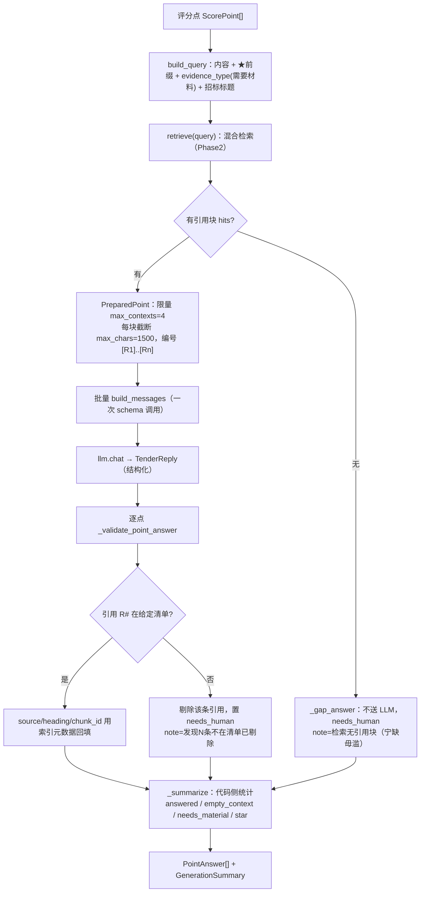

# Phase 3 交付报告 — 应答生成（Generator）

> 由 AI 编码生成，作为本阶段的分析与验收依据。代码即文档：若改动，请同步更新本文。

## 1. 本阶段目标与验收结果

把「逐评分点的引用块」变成「可直接给售前审核的应答草稿」，且**只依据给定引用块作答**（幻觉控制是本阶段主线）。

| 验收项 | 结果 |
|---|---|
| `uv run pytest` | ✅ 26 passed（含 Phase 0/1/2 回归 21 个 + 新增 5 个） |
| 样例招标书端到端 | ✅ 6 评分点 → 5 点带引用应答 + 1 点缺上下文自动 gap；引用可溯源 3 个语料文件 |
| 空上下文处理 | ✅ 不送 LLM、不硬答 → `needs_human` + 明示缺口（宁缺毋滥） |
| 引用编号校验 | ✅ 模型声称的 R# 不在给定清单 → 代码剔除并标记需人工 |
| 批量生成 | ✅ 有引用块的点一次 LLM 调用（token 省、延迟低），每点独立带引用 |
| 全链路离线 | ✅ MockProvider 结构化应答，确定性可回归 |

**样例实测输出（fixtures 语料，Mock LLM）**：

```
tender=智慧园区安防系统升级改造项目  评分点=6  语料块=16
summary: total=6 answered=5 empty_ctx=1 needs_human=2
needs_material: ['售后服务承诺函（盖章原件）', '报价一览表（须按招标格式填报）']
SP-01..04  已答 + 引用（来源 cases.md / qualifications-and-service.md / product-guide.md）需人工审核
SP-05  已答 + 引用，needs_human=True（缺"售后服务承诺函（盖章原件）"→ 商务需补盖章件）
SP-06  answer=""（价格分需按我方实际报价计算，本模块不自动出价）→ 自动标记缺口待人工报价
```

> 这正是售前想要的产出形状：5 段可引用、可溯源的应答 + 一张"缺什么待办清单"（盖章承诺函、报价一览表），而不是一坨幻觉。

## 2. 模块结构

```
core/generator/
├── schemas.py   数据契约：Citation / PointAnswer / TenderReply / GenerationSummary
├── query.py     build_query：评分点内容 + ★权重词 + evidence_type("需要材料：…") + 招标标题
├── prompt.py    SYSTEM_PROMPT(grounding 硬约束) + build_messages(批量组装，引用块限量截断)
├── service.py   Generator.generate() 主流程 + _validate_point_answer 引用校验 + _summarize
└── __init__.py  门面 / build_generator(settings, llm)
```

## 3. 主链路（mermaid）



## 4. 幻觉控制：三层防线（面试核心，背熟）

| 层 | 位置 | 机制 |
|---|---|---|
| ① 提示词硬约束 | `prompt.py` SYSTEM_PROMPT | 只允许依据给定引用块作答；主张事实/数据/案例必须标 `[Rx]`；没有引用支持的表述不得当既成事实；证据不足就写进 `missing_evidence`，绝不编造公司能力/案例 |
| ② 上下文隔离 + 空上下文 gap | `service.py` | 每个评分点**只有它自己检索来的引用块**进 prompt（别的点材料看不到 → 张冠李戴的空间被掐死）；引用块为空 → **不送 LLM**，直接标记缺口待人工（宁缺毋滥，不给模型编的机会） |
| ③ 引用编号代码校验 + 出处回填 | `_validate_point_answer` | 模型声称的 R# 不在本点清单 → **代码剔除**并置 needs_human（不信模型自报）；合法引用的 source/heading/chunk_id 一律用**索引侧真实元数据回填**（模型填的文本直接丢弃）——以索引为准，杜绝引用张冠李戴 |

**为什么引用要三层而不是只靠 prompt 约束**：提示词是"请求"，不是"保证"——模型偶发引用一个没给过的块，光靠第①②层拦不住。第三层是**确定性代码校验**，把"模型说了算"变成"清单说了算"，这是工程级（而非玩具级）幻觉控制的关键。

## 5. 结构化输出与批量策略

- **批量生成一次调用**：把有引用块的点组装进一条 user 消息，`schema=TenderReply` 一次返回所有点的应答 → token 省、延迟低、成本低。单点检索是为让**每个点拿到独立、精确的引用**（保证 citation 不串点）。
- **Coverage 强制**：LLM 返回后按 `point_id` 对照请求清单，模型**漏答的点会被显式标记** `needs_human`（"模型未返回该点应答"），绝不静默缺口。答了未请求的点则忽略。
- **统计在代码侧**：`answered/empty_context/needs_human/star_total/star_answered/needs_material` 全部由 `_summarize` 用已校验结果计算，不让模型"数数"。
- **★ 条款可追踪**：`star_total/star_answered` 单独记账 → Phase 7 报告能直出"★ 实质响应是否全覆盖"，直击"漏★=废标"痛点。

## 6. 已知局限（面试主动讲，加分）

1. **Mock 阶段应答是"形态演示"**：fixture 内容预置、非真语义；配真实 key（DashScope）后同一链路产出真应答——正确性评测留给 Phase 8 eval。
2. **引用块质量上限 = 检索质量上限**：Phase 2 召回若漏了关键材料，生成器只能如实报缺口（宁缺毋滥），不能无中生有——这是设计取舍：**宁要诚实缺口，不要幻觉补全**。
3. **max_contexts 截断**：单点引用块限 4 块、每块 1500 字，超长评分点（需大量支撑）可能信息不足 → 触发 missing_evidence/needs_human，留给人处理。
4. **单点独立检索 = 多次向量查询**：评分点一多查询次数线性涨（Phase 6 可用并行/批量检索优化）；离线样例 16 块语料代价可忽略。

## 7. 测试清单

```
tests/test_generator.py          单元：query 构造 / 空上下文 gap 不送 LLM / 非法引用剔除+回填 / 模型漏答标记+star 汇总
tests/test_generation_e2e.py     端到端：样例 PDF → 入库 → 逐点检索 → 带引用应答；断言 6 点齐全、引用可溯源 3 文件
```
