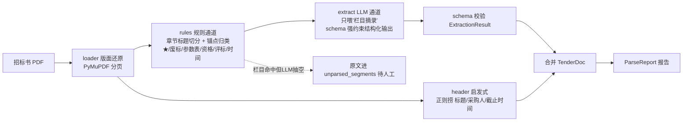

# Phase 1 交付报告 — 解析引擎（Parser）

> 由 AI 编码生成，作为本阶段的分析与验收依据。代码即文档：若改动，请同步更新本文。

## 1. 本阶段目标与验收结果

把"一份招标书 PDF"解析成结构化的 `TenderDoc`，同时产出可审计的 `ParseReport`。
后续 Phase 2/3/4 都只消费 `TenderDoc`，不再碰原始 PDF。

| 验收项 | 结果 |
|---|---|
| `uv run pytest` | ✅ 11 passed（含 Phase 0 回归 5 个） |
| 样例 PDF `fixtures/tender_sample.pdf` | ✅ 生成 3 页、嵌入微软雅黑、含全部"类型陷阱" |
| 规则层 6 类栏目命中 | ✅ 评分点/★条款/参数表/资格/废标/时间 全部定位到页 |
| LLM 结构化抽取（Mock） | ✅ schema 校验通过，fixture 按 `ExtractionResult` 路由 |
| 端到端 parse_tender | ✅ 标题/采购人/截止时间捞取正确，无"命中却抽空"缺口 |
| 全链路离线 | ✅ 不联网、确定性、可回归 |

## 2. 为什么是这个架构：双通道（规则 + LLM）

直接把几百页 PDF 整个塞给 LLM 抽结构化数据，有三宗罪：**贵**（token 爆炸）、**漏**（关键条款被吞）、**不可溯源**（不知道第几页）。
所以拆成两条通道，各干各擅长的事：



**分工哲学**（面试可讲）：
- **规则通道负责"确定性"**：★ 在第几页、废标条款有哪些，这些不靠模型猜 → 可溯源、零成本。
- **LLM 通道负责"语义"**：一条评分点要不要证据、这个参数是不是★关键参数，规则表达不了 → 交给模型。
- **关键防线**：规则层明明定位到了某栏目，LLM 却返回 0 条 → 不静默吞掉，把原文塞进 `unparsed_segments`（待人工），宁缺毋滥。

## 3. 模块结构与职责

```
core/parser/
├── schemas.py     数据契约（地基）：ScorePoint / StarClause / TechParamRow /
│                  TimelineItem / ExtractionResult / TenderDoc / ParseReport
├── loader.py      版面还原：PDF → List[Page]，保留 page_no（溯源用）
├── rules.py       规则通道：章节标题识别 + 关键词锚点 → 栏目摘录 SectionSpan
├── extract.py     LLM 通道：栏目摘录 → prompt（限长截断）→ 要求 schema 输出
├── pipeline.py    编排：串起全流程 + 头部启发式 + 缺失检测 + ParseReport
└── __init__.py    Parser 门面（对上层只暴露 TenderDoc）
```

### schemas.py —— 数据契约
一份招标书最终长这样（上层只见它）：
```python
TenderDoc(
    tender_title, buyer, deadline,          # 头部元数据
    score_points: list[ScorePoint],         # 每个含 id/内容/分值/是否★/所需证据
    star_clauses: list[StarClause],         # ★实质性条款 + 页码
    tech_params: list[TechParamRow],        # 参数表行（Phase4 判偏离的靶子）
    eligibility, waste_bid_terms, timeline, # 资格/废标/时间线
    unparsed_segments,                      # 抽不出/失败原文，待人工
)
```

### rules.py —— 规则通道的切分逻辑
1. 只有 `第X章/节` 这种标题行才当**栏目边界**，正文一律并入当前段 → 不会把参数表切碎；
2. 标题行命中关键词锚点才建段，锚点含"★""评标办法""废标"等（对应 config 里预留的 rule_anchors）；
3. 样例是一章一栏目，所以 6 类各命中 1 段，页面归属清晰。

**已知局限（诚实交代，面试加分）**：真实招标书版面五花八门，锚点命中率会下降 → 靠 `config.parser.rule_anchors` 调参 + Phase 5 自检兜底；扫描件无文本层需先 OCR，属既定边界。

## 4. 头部元数据为什么走"正则"不走 LLM
标题/采购人/截止时间是最不该出错的字段，一旦被幻觉污染整个标就完了。所以用确定性正则从首页/前两页捞，
捞不到就留空（宁可让用户补，不让模型编）。样例实测：

```text
tender_title: 智慧园区安防系统升级改造项目
buyer:        XX市智慧城市建设发展中心
deadline:     2026年10月31日 09:30（北京时间）
```

## 5. 测试清单（11 passed）

| 文件 | 覆盖 |
|---|---|
| test_settings.py | 默认 mock；dashscope 无 key 启动即报错（Phase 0） |
| test_health.py / test_mock_provider.py | 服务健康 / mock 契约（Phase 0） |
| **test_parser_rules.py** | PDF 有文本层、章节标题识别、6 类栏目全命中、★章与废标章不互污染 |
| **test_parser_pipeline.py** | 端到端：header 元数据、各栏目计数、结构抽查、报告 ok、缺文件必抛错 |

## 6. 切换到真实模型
只改两处，业务代码零改动：
```bash
# 1) .env 填 key         2) config/config.yaml: llm.provider → dashscope
```
LLM 抽取那条边即走 DashScope 的 json_schema 结构化约束（mock 的 ExtractionResult.json 是它的"离线替身"）。

## 7. 下一步（Phase 2 预告：入库与检索）
`TenderDoc` 已就绪 → Phase 2 做知识库：语料包切块入库 Qdrant 本地模式 + 混合检索
（向量 + BM25 → RRF 融合 → 重排），为 Phase 3"逐评分点应答"备料。
