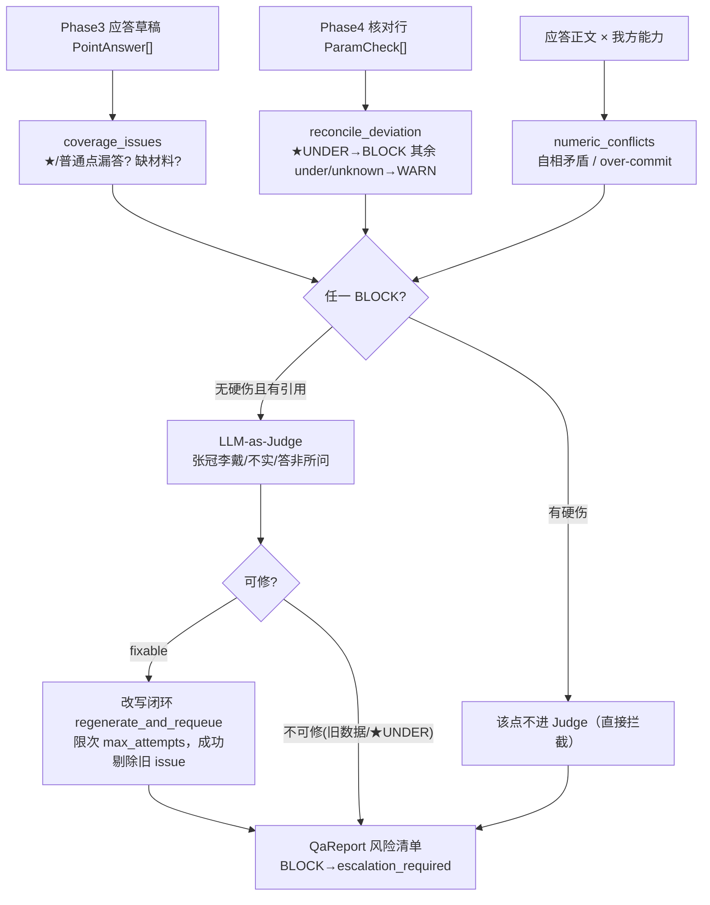

# Phase 5 交付报告 — 自检质检（QA / QA self-check）

> 由 AI 编码生成，作为本阶段的分析与验收依据。代码即文档：若改动，请同步更新本文。

## 1. 本阶段目标与验收结果

在"应答草稿已生成、数值已核对"之后、盖章投出之前，加一道**审标人防线**：把草稿 × ★条款 ×
数值核对 交叉核对，产出风险清单；判不了的语义风险交给 LLM-as-Judge，可修的进改写闭环。

| 验收项 | 结果 |
|---|---|
| `uv run pytest` | ✅ 71 passed（Phase 0–4 回归 42 + 新增 29） |
| 代码判三路 | ✅ 覆盖率 / 数值偏离复核 / 数值自洽·超承诺，全离线确定性 |
| Judge 防御 | ✅ 类别白名单 / reason 非空 / clean 置空 / point_id 回绑 |
| 改写闭环 | ✅ 可修 issue 打回重写、成功即剔除、限次不空转 |
| 样例端到端 | ✅ 全链路 QA：BLOCK=0 · WARN=2 · needs_material 汇总正确 |
| 全链路离线 | ✅ Mock + 纯代码核心 + 规则，确定性可回归 |

**样例实测输出（真实解析 TenderDoc × 真实语料 × 真实 Mock 应答）**：

```
GEN  total=6 answered=5 empty_context=1 needs_material=['售后服务承诺函（盖章原件）', '报价一览表（须按招标格式填报）'] needs_human_count=2
CALC total=14 conform=12 over=2 under=0 unknown=0 star_under=[]          # Phase4 全达标
QA   block=0 warn=2 info=0 escalate=False
QA   needs_material=['售后服务承诺函（盖章原件）', '报价一览表（须按招标格式填报）']
  - WARN material_gap   SP-05 | 应答承诺了能力，但证明文件缺失：售后服务承诺函（盖章原件）
  - WARN unanswered_point SP-06 | 价格分需按我方实际报价计算，本模块不自动出价 —— 丢分风险
```

> 为什么样例"只有 2 个 WARN"反而是对的价值：合规投标人本就不该有 BLOCK。引擎把真正该拦的
> 硬伤（★ 漏答 / ★ 负偏离 / 旧甲方残留）留给对抗用例 + 单测证明能抓，见 §6、§7。

## 2. 模块结构

```
core/qa/
├── schemas.py    数据契约：IssueSeverity(BLOCK/WARN/INFO) + IssueKind 白名单 + QaIssue/QaReport/QaVerdict
├── rules.py      ★代码判（确定性，最核心）：coverage_issues / reconcile_deviation / numeric_conflicts
├── prompt.py     LLM-as-Judge 的 prompt（审标人视角，三类语义风险 rubric）
├── judge.py      LLM-as-Judge：逐点评判 + _validate_verdict 防御（白名单/理由/clean/point_id）
├── service.py    QaService.run：三路代码判 → Judge → 改写闭环 regenerate_and_requeue → QaReport
└── __init__.py   门面 / build_qa(settings, llm)
```

## 3. 自检主链路（mermaid）



## 4. 三层"审标人"防线与判定表

| 层 | 判什么 | 怎么判 | 严重级 |
|---|---|---|---|
| **1. 覆盖率** | ★/普通评分点漏答、应答自报缺材料 | 代码（有答否 / missing_evidence 有否） | ★漏答→BLOCK；普通漏答/缺材料→WARN |
| **2. 数值偏离复核** | Phase4 核对结论转译 | 代码（只转译，不重判） | ★UNDER→BLOCK；普通 UNDER/UNKNOWN→WARN |
| **3. 数值自洽·超承诺** | 应答正文自相矛盾 / 超出我方能力 | 代码（parse_numeric 多数值扫描） | 矛盾/超承诺→WARN（可改写） |
| **4. LLM-as-Judge** | 张冠李戴/旧数据、不实、答非所问 | LLM（schema 约束 + 代码防御） | JUDGE_STALE→BLOCK；其余→WARN |

**三路代码判的"能判就判、判不了诚实放行"哲学（与 Phase 3 gap、Phase 4 UNKNOWN 一脉相承）**：
- 代码判是主裁（确定性、可回归、离线）；Judge 只补代码看不了的语义；
- Judge 输出过三道防御：类别必须在 `JUDGE_*` 白名单、reason 非空、`clean=true` 一律置空；
  严重级由**类别映射**决定而非模型自报（防模型把废标级风险降级成 INFO）。

## 5. 改写闭环（regenerate_and_requeue）

- 触发：该点存在 `fixable` 的 issue（如普通漏答、数值自相矛盾、Judge 判可改的不实/答非所问）；
- 动作：按评分点聚合反馈（evidence + reason + suggestion）→ 调用外部 `rewrite`（消费方用
  Generator 重新生成该点）→ **内容确有变化**才认定已修，剔除该点旧的 fixable 结论；
- 限次：`config.qa.max_attempts`（默认 1 = 只改一轮），改写器放弃/没真改 → 保留问题、不空转；
- 不可修的（JUDGE_STALE 旧数据、★UNDER 负偏离）永远留在风险清单 → **escalation_required**，
  Phase 7 报告会把它们置于顶部并拦截"直接投出"。

## 6. 数字陷阱（numeric_conflicts 防误报，面试可背几条）

| 场景 | 例 | 处理 |
|---|---|---|
| 多数值同句 | "质保 3 年并可延保至 5 年" | 逐步消费前一数值再解析下一数值，两句都抓 |
| 弱承诺语气 | 可延保 / 可选 / 约 / 左右 | hedge 判为"非硬承诺"，不进冲突/超承诺 |
| 真矛盾 | "质保 5 年" vs "质保 1 年" | 集合不相交 → NUM_CONFLICT |
| 可共存 | "工期 98 天" + "交付不晚于 120 天" | 98 ⊂ ≤120 → 不误报 |
| 超承诺 | 应答"质保期 5 年"、语料上限 3 年 | OVER_COMMIT |
| 数值越优方向 | 到场时效越小越优 | 承诺 1h < 能力下限 2h → OVER_COMMIT（方向表 _LOWER_BETTER） |
| 噪音数字 | 7×24 / GB/T28181 / 2560×1440 | 打码后不可能被当数量（复用 Phase4 口径） |
| 数字与单位带空格 | "98 日历天" | 定位用等长打码串 + 数字正则，不依赖 raw 精确回找 |

## 7. 已知局限（面试主动讲，加分）

1. **改写闭环不清新引入的问题**：改写成功只剔除该点旧的 fixable issue，不重跑三路代码判去
   扫"越改越坏"的新矛盾 —— 新问题在下一次 QA 轮次/Phase 7 复核暴露（诚实记录，避免过度承诺）。
2. **numeric_conflicts 的比较词归属**：复用的 `parse_numeric` 在全句范围内找比较词；同一标点
   小句内出现"多个数值 + 一个比较词"时，比较词可能被错误归属到第一个数值（如把"不少于 120"
   的 ≥ 也算到前一个 98 头上）。正常投标行文按分号/逗号断句，该场景少；文档不夸大覆盖。
3. **语义风险判定依赖 Judge**：张冠李戴的旧甲方/旧项目名，只有 LLM-as-Judge 能拦；离线 Mock
   默认判 clean（fixture），接真实 key 才真正启用 —— 换模型零业务改动。
4. **覆盖率判"实质应答"较粗**：只要有非空 answer 就算答上；答的是否扣题靠 Judge 的 off-topic
   与人工。★ 实质条款的"实质响应"最终仍需售前人工放行（本层负责"提醒与拦截"，不替代人）。
5. **超承诺只对 KNOWN_TOPICS 的数值能力**判：非数值能力（资质/案例真伪）不在本层。

## 8. 测试清单

```
tests/test_qa.py      单测 28：覆盖率(★/普通漏答/缺材料严重级) · 偏离转译(★UNDER→BLOCK) ·
                      数值自洽(真矛盾/可共存/弱承诺/超承诺/方向/噪音/空答) · Judge 防御(clean/白名单/空理由/回绑) ·
                      Service(离线规则/escalation/JUDGE_STALE→BLOCK/改写闭环成功与不空转/needs_material)
tests/test_qa_e2e.py  端到端：样例 PDF→解析→入库→生成→核对→QA；断言 BLOCK=0、仅 WARN、材料汇总、终版对齐
```

对抗用例（证明能"抓坏"）：
- 把 ★ 评分点从应答里删掉 → `UNANSWERED_STAR` BLOCK，escalation_required=True（★ 漏答 = 废标风险）；
- 把某 ★ 参数改成达不到的值 → Phase4 `star_under` → QA 复核转译 BLOCK；
- 让 Judge 返回"应答仍带旧项目甲方" → `JUDGE_STALE` BLOCK，且不进改写（交人工删旧数据）。
