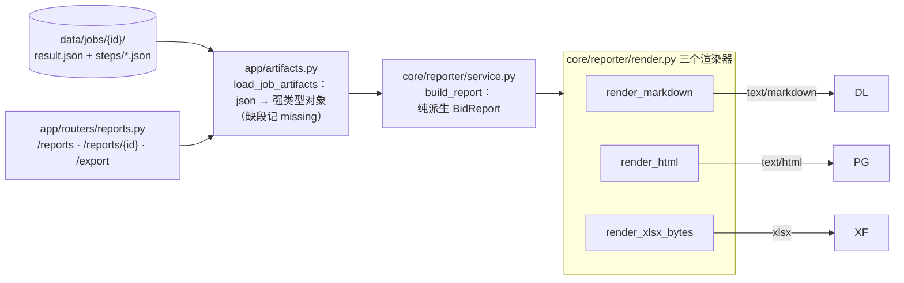

# 应标 Agent — 报告器与导出（Phase 7）

> 前六阶段产出的都是结构化数据，全部落盘 `data/jobs/{id}/`。Phase 7 的职责是**把它们变成给售前审的报告**：一屏结论 / 风险清单（BLOCK 置顶）/ 逐评分点应答包 / 数值核对明细 / 附录，并给 HTML 报告页 + Markdown/Excel 三种出口。业务痛点/面试点总览见父目录 `README.md`。

## 0. 四个核心设计决定

### ① 报告器是纯派生视图，绝不重跑任何引擎

`core/reporter` 只**读** `result.json` + `steps/*.json`，把它重排成 `BidReport`。不调 LLM、不检索、不复判、不重新 parse。

- **可复现**：报告内容与当初跑完时一致；job 目录不删，随时重开同一份报告；
- **不双跑**：报告若重跑引擎 = 第二遍执行，慢且结果可能漂（第二次检索排序不同）；
- **纯函数可单测**：`build_report(result, doc, answers, checks)` 喂手造对象即出报告，零 fixture、离线确定。

> 一个诚实的工程注记：做 Phase 7 时发现 Phase 6 只落了 `04_calc_summary`（聚合数），而报告要展示"每行核对明细"，所以在 `app/jobs.py` 补落了一步 `04_calc_checks.json`（每行 `ParamCheck`）。这正是"落盘后门"被兑现时暴露的真实缺口。

### ② 信息架构按"决策序"排，读者是售前不是工程师

读者要决定"这份能不能投、还差什么"。顺序 = 他的工作流：

```
一屏结论（可投/需拦截 + BLOCK/待补/未答计数）
  → 风险清单（BLOCK 红 / WARN 橙 / INFO 灰，带出处）
  → 待补材料
  → 逐评分点应答包（要求原文 → 应答正文 [R#] 引用 → 缺口/命中风险）
  → 数值核对明细（每行 要求 vs 声明 vs CONFORM/OVER/UNDER/UNKNOWN）
  → 附录（★条款/解析警告 unparsed）
```

`escalation_required=True` 的语义在此兑现：不是 JSON 里一个布尔，而是报告顶部那句
**"⚠️ 存在废标级(BLOCK)风险 —— 投出前必须人工复核"**（HTML 红横幅 / Markdown 首行）。

### ③ 单一产物源 + 多出口（一个模型，三个渲染器）

`BidReport` 是唯一的"报告真相"，三种出口只是它的渲染器：

| 出口 | 载体 | 用途 |
|---|---|---|
| Markdown | `render_markdown` | 正文报告，可导入 Word / 进 git diff |
| HTML | `render_html` | 浏览器报告页 + 目录页（内联 CSS、风险着色、可打印 PDF） |
| Excel | `render_xlsx_bytes` | 概览 / 应答包 / 数值核对 / 风险清单 四 sheet，售前可筛选 |

**为什么**：业务内容只写一遍（`build_report`），新增导出 = 新增一个 renderer，不做"md 一套、html 又一套"。所有模型/LLM 文本在 HTML 一律 `html.escape`（防注入）。每个输出带 job_id + 生成时间页眉，可溯源。

### ④ UI 取舍：不自建第二个服务

架构图原稿画了 "Streamlit 面板"。Phase 7 改为 **FastAPI 同进程出 HTML 报告页 + 目录页**：

- 单一进程 / 同一数据目录：报告页直接读 `data/jobs/`，与 job 状态机同源，零状态同步问题；
- curl 就能演示全链路；不引入第二套运行时/框架，守住"后端 FastAPI"底座。

Streamlit 记为后续可扩展。

## 1. 组件与职责



## 2. 落盘产物 → 报告

`app/artifacts.py:load_job_artifacts` 读回四份素材（缺哪段记 `missing`，报告顶部黄条提示，绝不抛）：

| 文件 | 类型 | 报告里用在哪 |
|---|---|---|
| `result.json` | `JobResult` | 一屏结论 / gen/calc/qa 汇总 / issues |
| `steps/01_parse_doc.json` | `TenderDoc` | 评分点要求原文、★、采购人/工期、unparsed |
| `steps/03_gen_answers.json` | `PointAnswer[]` | 逐点应答正文 + [R#] 引用 + 缺口 |
| `steps/04_calc_checks.json` | `ParamCheck[]` | 数值核对明细（每行判定） |

## 3. HTTP 接口

| 方法 | 路径 | 作用 |
|---|---|---|
| GET | `/reports` | HTML 目录页：全部任务（job_id/标书/状态/可投拦截徽标 + md/xlsx 下载链接） |
| GET | `/reports/{job_id}` | HTML 报告页（一屏结论红/绿横幅 → 风险 → 逐点 → 数值核对 → 附录） |
| GET | `/reports/{job_id}/export?fmt=md` | 下载 Markdown（`text/markdown` attachment） |
| GET | `/reports/{job_id}/export?fmt=xlsx` | 下载 Excel 四 sheet |

错误：任务不存在/无产物 → 404；`fmt` 非法 → 400（FastAPI pattern 校验）。

## 4. 样例实测（离线 mock，真实 fixture + 真实语料）

`POST /tasks` 跑完样例 → `GET /reports/{job}`：

```
HTML 报告页 200：顶部绿横幅"✅ 无 BLOCK"；stat 6 评分点已答 / 5★ / 0 BLOCK / 2 WARN / 0 负偏离
风险清单：2 条 WARN（SP-05 缺盖章承诺函 · SP-06 价格分需人工），BLOCK=0
待补材料：售后服务承诺函（盖章原件）· 报价一览表（须按招标格式填报）
逐评分点应答：6/6 列出，5 条有正文（带 [R#] 引用回语料块），SP-05 空应答标"缺材料"
md 导出 200 · xlsx 导出 200（四 sheet 可被 openpyxl 打开）
```

> 数字随语料/样例漂移，测试只断言形状（test_reporter.py 锁结构/横幅/escape/sheet 名）。简历业务数字一律 Phase 8 eval 实测。

## 5. 局限（如实记录）

- HTML 应答正文用 `<pre>` 等宽展示（未做 md→html 转换，避免引 markdown 渲染依赖）；原文是 markdown，售前可直接用导出 md。
- 目录页读整个 `data/jobs/`（demo 规模无碍）；任务多时要分页。
- xlsx 用 openpyxl 流式写 BytesIO，进程内生成（大报告可后置异步）。
- Word 导出暂缓：Markdown 可直接导入 Word；正式标书排版模板在 README「明确不做」范围。

## 6. 跑起来

```bash
uv run uvicorn app.main:app --reload
# 起服务后：
curl -s -F "file=@fixtures/tender_sample.pdf" http://127.0.0.1:8000/tasks        # 跑一条标
# 浏览器打开 http://127.0.0.1:8000/reports                                        # 目录页
curl -s http://127.0.0.1:8000/reports/{JOB_ID} | head -40                        # HTML 报告
curl -s -o report.md  http://127.0.0.1:8000/reports/{JOB_ID}/export?fmt=md       # Markdown
curl -s -o report.xlsx http://127.0.0.1:8000/reports/{JOB_ID}/export?fmt=xlsx    # Excel
```
