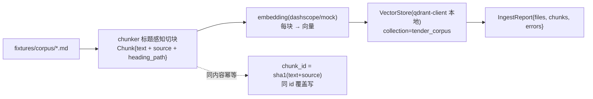
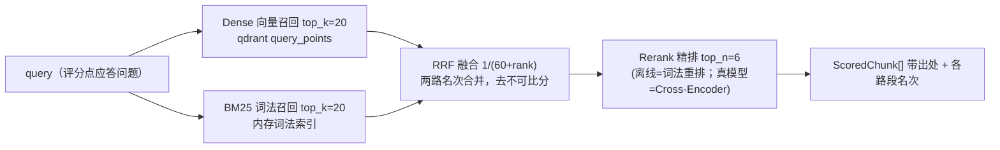

# Phase 2 交付报告 — 入库与检索（Ingest & Retriever）

> 由 AI 编码生成，作为本阶段的分析与验收依据。代码即文档：若改动，请同步更新本文。

## 1. 本阶段目标与验收结果

把"公司语料（Markdown）"入库成可检索的知识库，并实现**混合检索**（Dense+BM25→RRF→Rerank），
让 Phase 3 能对每个评分点 query 拿到"带出处的引用块"。

| 验收项 | 结果 |
|---|---|
| `uv run pytest` | ✅ 21 passed（含 Phase 0/1 回归 11 个） |
| 入库样例语料 | ✅ 3 文件 → 16 块，0.014s，无错误（fixtures/corpus） |
| qdrant-client 本地模式 | ✅ 1.19.0（内存/落盘均通，无 Docker） |
| 混合检索冒烟 | ✅ query 召回正确来源；top1 带 dense/bm25/rrf/rerank 全路名次 |
| 全链路离线 | ✅ MockEmbedding 伪向量 + MockReranker 词法重排，确定性可回归 |

## 2. 模块结构

```
core/
├── ingest/
│   ├── chunker.py    标题感知切块：Chunk{id,text,source,heading_path} + overlap + 超长细分
│   ├── pipeline.py   目录→分块→向量→入库，返回 IngestReport；整包重建语义
│   └── __init__.py   Ingester 门面
├── embeddings/       EmbeddingProvider 协议 + MockEmbedding + DashScopeEmbedding + 工厂
├── vector_store.py   Qdrant 封装（collection 按 embedding 维度校验、点 id=uint64(chunk_id)、
│                     query_points 召回、all_payloads 供 BM25 重建）
└── retriever/
    ├── tokens.py     中文轻量分词：CJK 单字+双字 n-gram，英文型号整串保留
    ├── bm25.py       纯 Python BM25(k1=1.5, b=0.75)
    ├── fusion.py     RRF 融合 1/(k+rank), k=60
    ├── rerank.py     Reranker 协议 + MockReranker(词法) + DashScopeReranker(待接入)
    ├── schemas.py    ScoredChunk（含各路段名次，可观测）
    ├── service.py    Retriever：串联五步，返回排序引用块
    └── __init__.py   门面/工厂
```

## 3. 入库链路



### 关键决策
1. **标题感知切块**：不按固定字符数硬切（会把参数表/数值劈开）；用 Markdown 标题层级做边界，
   块自带 `heading_path` → 命中后能说"来自产品手册 §NVR 技术参数"，支撑引用溯源。
2. **块内容哈希做 id**：同内容再入库幂等覆盖，不会产生重复点。
3. **整包重建语义**：语料规模小，每次入库先清集合；增量更新留到 Phase 6。
4. **存储抽象**：`VectorStore` 构造支持 `path=`(本地/无docker) 或 `url=`(生产服务器)，
   **上层代码零改动** —— 这是"本地复现、生产可切"的工程化卖点。
5. **Embedding Provider 化**（同 llm/）：无 key 时 MockEmbedding 用哈希 n-gram 伪向量保链路；
   DashScopeEmbedding(text-embedding-v3) 已按 OpenAI 兼容 `/embeddings` 实现，配 key 即真语义。

### 已知局限（诚实）
- **伪向量无语义**：离线命中靠 BM25 + 词法重排撑住；真实向量语义需配 key 走 DashScope。
- 切块当前按英文 `\n`/标题，表格等富格式文本的语义边界仍可能被切断（接受，Phase 6 可按文档类型升级）。

## 4. 混合检索链路



### 为什么混合（核心面试点）
| | 纯向量(Dense) | 纯 BM25 |
|---|---|---|
| 擅长 | 语义改写（"违规检测"→"行为识别"） | 精确词/型号/数字（400万、GB/T28181） |
| 短板 | 数字/专有名词迟钝，长 query 稀释 | 同义改写召回不了 |

投标应答**两头都吃**：要精确响应对齐招标参数，又要灵活匹配自家语料的同义表述 → 必须混合。

### RRF 为什么看名次不看分数
两个检索器分数量纲/分布不同（余弦相似度 vs 词频 BM25），不可直接相加；
"排名第几"是可比序 → `1/(k+rank)` 融合天然免归一化，且对单路异常高分稳健。k=60 为经验值。

### 重排为什么放最后
Cross-Encoder 把 query 和每个候选**拼起来过同一模型**，精度高于双塔，但逐对推理贵 →
只对融合后的少量候选做（窄精排），前面用宽召回保证不漏。

### 已知局限
- **DashScopeReranker 未接入**：真实 gte-rerank-v2 需要 DashScope 专用 rerank 接口，
  当前 `get_reranker` 在 provider=dashscope 时明确 raise（防误用）。接通真实 key 联调时补。
  离线默认 MockReranker 是**词法重叠确定性排序**——无模型、可复现，keyword 场景合理站位。
- BM25 每次查询现算全语料；语料变大需预建索引/增量（Phase 6 优化项）。

## 5. 测试清单（21 passed）

| 文件 | 覆盖 |
|---|---|
| 旧回归 | Phase 0 配置/健康/mock、Phase 1 解析（11 个） |
| test_chunker.py | 标题边界不串章节、章节路径、超长细分+overlap、id 稳定、语料可切 |
| test_retriever_unit.py | 分词(型号整串/中文n-gram)、BM25 命中序、空语料、RRF 序 |
| test_retrieval_e2e.py | 入库16块→按 query 召回正确来源文件；ranks 带全路段名次 |

## 6. 运行方式

```bash
uv run pytest                       # 21 passed（离线）
uv run python - <<'PY'              # 交互式看一次入库+检索
import asyncio
from config.settings import get_settings
from core.ingest import ingest_corpus
from core.retriever import Retriever
from core.vector_store import VectorStore
async def main():
    s = get_settings()
    st = VectorStore(s.vector_db.collection, s.embedding.dimension, path=":memory:")
    await ingest_corpus("fixtures/corpus", st, s)
    for r in await Retriever(s, st).retrieve("高清网络摄像机 400万像素", top_k=3):
        print(r.final_rank, r.source, "|", r.heading, "|", r.ranks)
asyncio.run(main())
PY
```

## 7. 切真模型（改两处，业务代码零改动）
1. `.env` 填 `DASHSCOPE_API_KEY`；
2. `config/config.yaml`：`llm.provider=dashscope`、`embedding.provider=dashscope`。
3. rerank 接入真 Cross-Encoder 前保持 `rerank.provider=mock`。

## 8. 下一步（Phase 3：应答生成）
`Retriever.retrieve(query)` 就绪 → Phase 3 对每个评分点构造 query → 拿引用块 →
LLM 按 schema 生成"逐点应答 + 引用标注"，缺失证据进"待补清单"。
